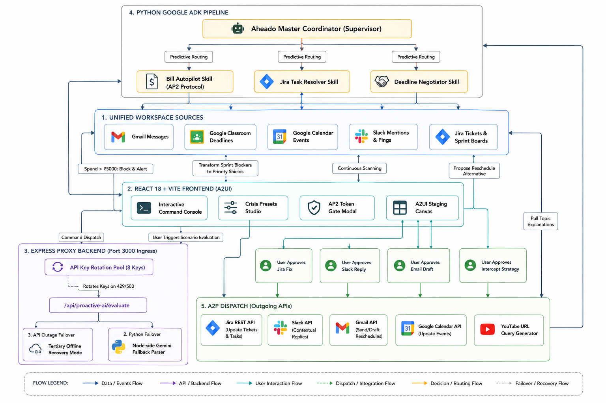
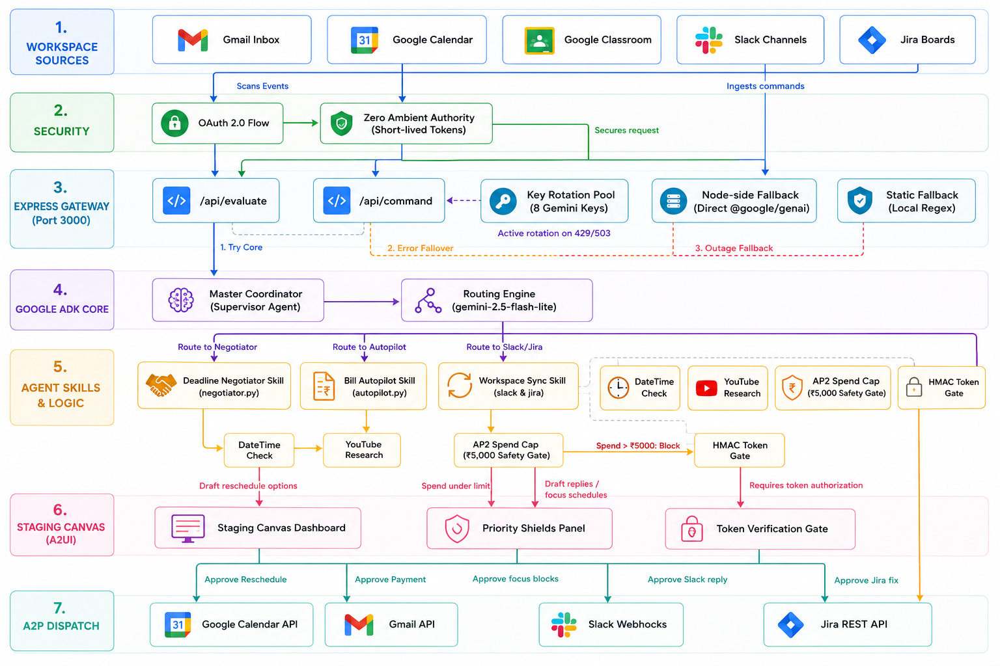

# Aheado — Proactive AI-Agent Workspace Guard

Aheado is an advanced proactive academic and personal co-pilot designed to protect users from scheduling collisions, task overload, and missed commitments by serving as an automated workspace autopilot.

---

## 📌 Problem Statement
Students, professionals, and entrepreneurs frequently miss critical deadlines, assignments, meetings, bill payments, and interviews. Existing productivity tools rely on passive reminders that are easy to ignore and do little to help users actually complete tasks. The challenge is to build an AI-powered companion that proactively plans, prioritizes, and automates action before deadlines are missed.

## 🚀 Project Overview
Aheado shifts users from a reactive state of managing stress to an autonomous state of productivity. By continuously monitoring workspace environments (Google Classroom, Gmail, Google Calendar, Slack, and Jira), it preemptively identifies scheduling conflicts, negotiates deadlines, drafts context-aware communications, and recommends verified learning resources on an interactive staging canvas for direct user execution.

---

## 🎨 System Architecture Diagram


A high-level schematic detailing the data flow from Workspace Sources into the React 18 + Vite frontend (A2UI), routing through the Express proxy backend with a tiered failover pipeline, processing via the Python Google ADK agentic pipeline, and deploying back to active platform APIs.

---

## 🤖 End-to-End Agent Architecture Diagram


A detailed 7-layer breakdown illustrating real-time context ingestion, Zero Ambient Authority OAuth authentication, Express key rotation and failover gateways, Google ADK supervisor planning, specialized skill execution (with safety interlocks like chronological validation and AP2 spending gates), the staging canvas, and outbound A2P dispatch.

---

## 🌟 Key Features
* **Core Brain (Google ADK & Modular Skills)**: Orchestrates specialized sub-agents (`deadline_negotiator`, `bill_autopilot`, `slack_workspace_sync`, `jira_task_resolver`) to analyze and resolve workspace crises.
* **Cross-Platform Autopilot**: Accepts natural language commands to automatically draft emails, create calendar events, and locate school deadlines.
* **Agent-to-User Interface (A2UI) Canvas**: Interactive staging deck where users review, edit, approve, or reject proposed actions before they are executed.
* **Day Integrity Shield & Minutes Rescued**: Real-time metrics visualizing overall daily schedule health and total administrative time saved.
* **AP2 Secure Token Gate**: Spend guardian that blocks automated transactions over ₹5,000, requesting manual verification tokens.
* **Multi-Key API Rotation Pool**: Robust backend rotation for up to 8 developer keys to prevent API rate limits with fallback recovery.
* **Unified Settings & Gamified Badges**: Integrated integration hubs and unlockable badges to reward proactive workspace management.

---

## 🛠️ Tech Stack
* **React 18**: Frontend SPA framework managing component states and local sandbox simulations.
* **Vite**: Ultra-fast build tool and development server.
* **Tailwind CSS**: Utility-first CSS styling for modern glassmorphic designs.
* **Lucide React & Framer Motion**: Responsive vector icons and fluid layout micro-animations.
* **Node.js & Express**: Secure backend proxy router, key management, and API gateway.
* **Electron**: Standalone desktop shell wrapper for cross-platform distribution.
* **Python 3**: Script runtime hosting agent domain schemas and the skills framework.

---

## 🤖 Google Technologies Used
* **Google Agent Development Kit (ADK)**: Core server-side reasoning pipeline inside `python_core` managing context and routing.
* **Gemini Generative AI Model (`gemini-2.5-flash-lite` & `gemini-2.5-flash`)**: Multi-agent orchestration engine for classification and JSON payload formatting.
* **Google GenAI SDK (`@google/genai`)**: Central API client library supporting Python execution and Node fallback.
* **Google Workspace APIs**: Live/simulated integrations for Google Calendar, Gmail, and Google Classroom.
* **Google Bubblewrap CLI**: CLI used to compile the web application into a native Android APK (TWA).
* **Google AI Studio**: Fast prototyping, prompt refinement, and developer hosting environment.

---

## ⚙️ Setup & Installation Instructions

### 📋 Prerequisites
* **Node.js**: v18 or later
* **Python**: v3.10 or later
* **Google Gemini API Key(s)**: At least one is required

### Step 1: Clone the Repository
```bash
git clone https://github.com/SumithAshokShetty/Aheado.git
cd Aheado
```

### Step 2: Configure Environment Variables
Create a `.env` file in the root directory:
```env
# Add your Gemini API key (supports key-rotation pool)
GEMINI_API_KEY="your_primary_api_key_here"
GEMINI_API_KEY_2="your_secondary_api_key_here"
```

### Step 3: Initialize Backend & Python ADK Core
```bash
# Install Node.js dependencies
npm install

# Create and activate a virtual environment
python -m venv venv
# On Windows: venv\Scripts\activate
# On macOS/Linux: source venv/bin/activate

# Install requirements
pip install -r requirements.txt
```

### Step 4: Run the Application
Starts the Express proxy gateway (on port 3000) and compiles the React app:
```bash
npm run dev
```
Open `http://localhost:3000` to interact with the web interface.

---

## 🔗 Project Links
* **Production Web Engine URL**: [Aheado](https://aheado-1022664181538.asia-southeast1.run.app/)
* **Native Desktop Production Client Build Link**: [Aheado Desktop](https://drive.google.com/drive/folders/1UwMhH168fcrwSFnzEUj_5va978X0q5Dc)
* **Native Android Application Package (APK via Bubblewrap) Link**: [Aheado Mobile](https://drive.google.com/drive/folders/1CcOnVQLxcY89Y-xls_PVMR8q2ca7Zt4W)
* **Aheado Demo Video**: [Video](https://drive.google.com/file/d/1R9A3Kj9YCPZ9dUsfUyInJQJkHPy23U-Q/view?usp=sharing)

---

## ⚠️ Important Project Note for Hackathon Reviewers
The Google Cloud project driving this application is automatically provisioned and managed directly by **Google AI Studio** behind the scenes to power our development sandbox environment.
Because this is a platform-managed deployment, developer accounts are granted restricted access to monitor deployment logs and active services (such as Cloud Run). We do not possess administrative Owner or IAM permissions to modify project-wide security configurations, manage global OAuth client credentials, or self-grant elevated administrative roles.
Consequently, we cannot manually bypass the Google production sandbox restrictions or verify the OAuth Consent Screen. To protect user privacy, Google strictly prevents unverified applications from accessing live user Google Workspace environments. As a result, evaluators or visitors will not be able to sign in using their own personal Google accounts.

### How to Evaluate the Live Application
* **Use the Judge Bypass**: Simply click "Judge Bypass" (or "Try as Guest") on the application login screen. This grants you immediate, full access to the Crisis Preset Studio and allows you to interactively explore the live Aheado workspace without any authentication friction.
* **Watch the Guided Walkthrough**: I highly recommend going through the official Demo Video to see the true essence of how Aheado actively monitors, intercepts, and handles real-time workspace crises.

